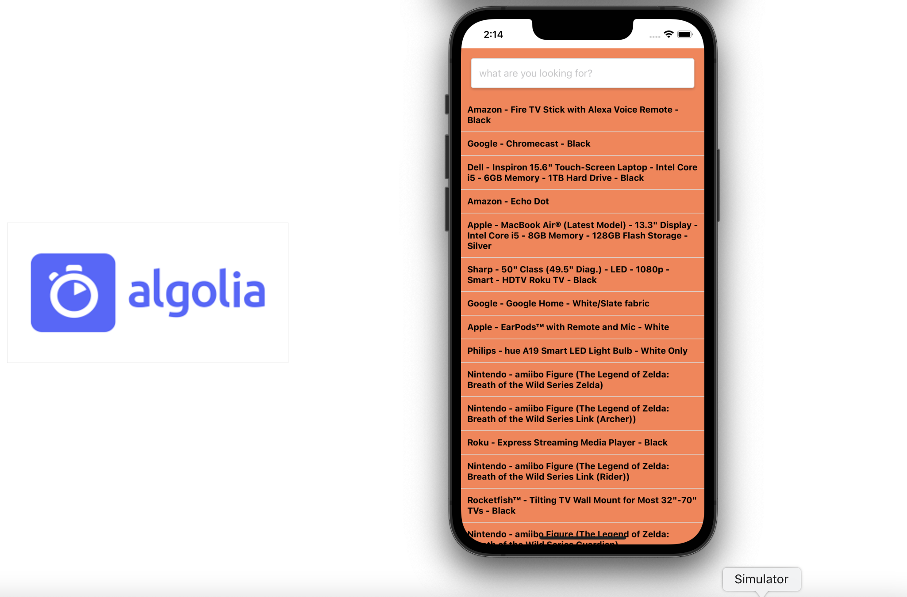

# react-native-algolia-search



<!-- This simple project shows how to integrate the [Yoco Web SDK for Online Payments](https://developer.yoco.com/online/getting-started) into a React web app. -->

> Tested with Node v14.19.0

# Run

In the project directory, run:

```bash
git clone https://github.com/sisoalbert/react-native-algolia-search.git
yarn install
yarn start
```

This runs the app in development mode.
Open [http://localhost:3000](http://localhost:3000) to view it in your browser.
The page will reload when you make changes.
You may also see any lint errors in the console.

# Build

To package the app and prepare it for deployment run:

```bash
yarn run build
```

This builds the app for production to the `build` folder.
It correctly bundles React in production mode and optimizes the build for the best performance.
The build is minified and the filenames include the hashes.

# Run static build

To test the build you can use a static server as follows:

```bash
  yarn global add serve
  serve -s build
```

You are now ready to deploy the app to static hosting, or use it with a backend server deployment.

---

This project created with [Vite](https://vitejs.dev/guide/#scaffolding-your-first-vite-project).
